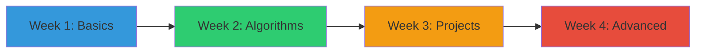

# 🚀 Machine Learning for Beginners
**Your Friendly Guide to Artificial Intelligence • From Zero to Hero!**

<div align="center">


[](https://python.org)
[](https://scikit-learn.org)
[](LICENSE)
[](https://github.com)

</div>

---

## 📖 Table of Contents
- [🎯 What is Machine Learning?](#-what-is-machine-learning)
- [🚀 Why Learn ML?](#-why-learn-ml)
- [🧩 Types of Machine Learning](#-types-of-machine-learning)
- [🔧 Essential Tools](#-essential-tools)
- [📊 Key Concepts](#-key-concepts)
- [🎨 Visual Learning](#-visual-learning)
- [🛠️ Hands-On Projects](#️-hands-on-projects)
- [📈 Real-World Applications](#-real-world-applications)
- [🌟 Learning Path](#-learning-path)
- [❓ Frequently Asked Questions](#-frequently-asked-questions)

---

## 🎯 What is Machine Learning?

<div align="center">


</div>

**Machine Learning** is like teaching computers to learn from experience! Instead of giving explicit instructions, we show examples and let the computer find patterns.

### 🔍 Simple Analogy
> 🧒 **Teaching a Child vs. Teaching a Computer**
> 
> **Child**: Show many cats and dogs → Learns to recognize them
> **Computer**: Feed labeled images → Creates rules to distinguish them

---

## 🚀 Why Learn ML?

<div align="center">

| 🎯 Career Opportunities | 💡 Problem Solving | 🌍 Impact World |
|------------------------|-------------------|-----------------|
| **High Demand** 📈 | **Creative Solutions** 🎨 | **Real Impact** 🌟 |
| $100K+ Average Salary | Solve complex problems | Healthcare, Environment, Education |

</div>

### 📊 Industry Growth
```
ML Job Market Growth: ██████████ 100% (2020-2024)
Average Salary: $120,000+ 💰
Industries Using ML: Healthcare, Finance, Retail, Tech, Automotive
```

---

## 🧩 Types of Machine Learning

<div align="center">

### **Three Main Categories**

</div>

### 1. 🎓 Supervised Learning
**"Learning with a teacher"** - We provide labeled data

<div align="center">

| Type | Purpose | Example |
|------|---------|---------|
| **Classification** 🏷️ | Categorize data | Spam vs Not Spam |
| **Regression** 📈 | Predict values | House Price Prediction |

</div>

**Algorithms**: Linear Regression, SVM, Decision Trees, Neural Networks

### 2. 🔍 Unsupervised Learning
**"Learning without guidance"** - Find patterns in unlabeled data

<div align="center">

| Type | Purpose | Example |
|------|---------|---------|
| **Clustering** 🎯 | Group similar data | Customer Segmentation |
| **Dimensionality Reduction** 📉 | Simplify data | Image Compression |

</div>

**Algorithms**: K-Means, PCA, Autoencoders

### 3. 🎮 Reinforcement Learning
**"Learning by trial and error"** - Agent learns through rewards/punishments

**Example**: Teaching a robot to walk, Game AI (AlphaGo)

---

## 🔧 Essential Tools

<div align="center">

### **Python ML Stack**


</div>

### 🐍 Core Libraries
```python
# Essential imports for every ML project
import numpy as np          # 🧮 Numerical computations
import pandas as pd         # 📊 Data manipulation
import matplotlib.pyplot as plt  # 📈 Visualization
import seaborn as sns       # 🎨 Advanced plots
from sklearn import *       # 🤖 Machine learning algorithms
```

### 🛠️ Installation Guide
```bash
# Quick setup for beginners
pip install numpy pandas matplotlib seaborn scikit-learn jupyter
```

### 📓 Jupyter Notebooks
**Perfect for beginners!** Interactive coding environment
```bash
jupyter notebook
```

---

## 📊 Key Concepts

### 1. 🎯 The ML Workflow

```mermaid
graph TD
    A[📥 Data Collection] --> B[🧹 Data Cleaning]
    B --> C[🔍 Exploratory Analysis]
    C --> D[⚡ Feature Engineering]
    D --> E[🤖 Model Training]
    E --> F[📊 Model Evaluation]
    F --> G[🚀 Deployment]
    
    style A fill:#3498DB
    style B fill:#E74C3C
    style C fill:#F39C12
    style D fill:#9B59B6
    style E fill:#2ECC71
    style F fill:#1ABC9C
    style G fill:#E67E22
```

<div align="center">



</div>

### 2. 📈 Model Evaluation Metrics

<div align="center">

| Metric | Formula | Ideal Value | Purpose |
|--------|---------|-------------|---------|
| **Accuracy** | (TP+TN)/Total | High 🎯 | Overall correctness |
| **Precision** | TP/(TP+FP) | High 🎯 | Avoid false alarms |
| **Recall** | TP/(TP+FN) | High 🎯 | Find all positives |
| **F1-Score** | 2*(P*R)/(P+R) | High 🎯 | Balanced measure |

</div>

### 3. ⚠️ Common Pitfalls

- **Overfitting** 📈: Model learns training data too well
- **Underfitting** 📉: Model too simple to capture patterns
- **Data Leakage** 🚰: Test information in training data

---

## 🎨 Visual Learning

### 1. 📊 Data Visualization Examples

```python
# Sample visualization code
import matplotlib.pyplot as plt
import seaborn as sns

# Create subplots
fig, axes = plt.subplots(2, 2, figsize=(12, 10))

# 1. Scatter Plot
axes[0,0].scplot(x='feature1', y='feature2', data=df, hue='target')
axes[0,0].set_title('Feature Relationships')

# 2. Distribution
axes[0,1].hist(df['feature1'], bins=30, alpha=0.7)
axes[0,1].set_title('Feature Distribution')

# 3. Correlation Heatmap
sns.heatmap(df.corr(), annot=True, ax=axes[1,0])
axes[1,0].set_title('Correlation Matrix')

# 4. Box Plot
sns.boxplot(x='target', y='feature1', data=df, ax=axes[1,1])
axes[1,1].set_title('Feature by Target')

plt.tight_layout()
plt.show()
```

### 2. 🎯 Algorithm Decision Boundaries

<div align="center">

#### **Comparison of Different Algorithms**

| Algorithm | Decision Boundary | Best For |
|-----------|-------------------|----------|
| **Linear SVM** | Straight line | Linear data |
| **Decision Tree** | Step-like | Interpretable rules |
| **Neural Network** | Complex curves | Complex patterns |

</div>

### 3. 📈 Learning Curves

<div align="center">

**Ideal Learning Curve:**
```
Accuracy
   ↑
   |    🟢 Validation Score
   |   /
   |  /
   | /
   |/___________ Training Score
   |
   +-------------------> Training Size
```

</div>

---

## 🛠️ Hands-On Projects

### 🎯 Beginner-Friendly Projects

<div align="center">

| Project | Skills Learned | Dataset |
|---------|----------------|---------|
| **Iris Flower Classification** 🌸 | Classification, EDA | Built-in |
| **House Price Prediction** 🏠 | Regression, Feature Engineering | Kaggle |
| **Spam Detection** 📧 | Text Processing, NLP | UCI Repository |
| **Customer Segmentation** 👥 | Clustering, Visualization | Mall Customers |

</div>

### 🚀 Quick Start Template
```python
# ML Project Template
import pandas as pd
from sklearn.model_selection import train_test_split
from sklearn.ensemble import RandomForestClassifier
from sklearn.metrics import accuracy_score

# 1. Load Data
data = pd.read_csv('your_data.csv')

# 2. Prepare Features & Target
X = data.drop('target', axis=1)
y = data['target']

# 3. Split Data
X_train, X_test, y_train, y_test = train_test_split(X, y, test_size=0.2)

# 4. Create and Train Model
model = RandomForestClassifier()
model.fit(X_train, y_train)

# 5. Make Predictions and Evaluate
predictions = model.predict(X_test)
accuracy = accuracy_score(y_test, predictions)
print(f"🎯 Model Accuracy: {accuracy:.2%}")
```

---

## 📈 Real-World Applications

<div align="center">

### **ML is Everywhere!**

</div>

### 🏥 Healthcare
- **Disease Diagnosis** 🩺 - Detect cancer from medical images
- **Drug Discovery** 💊 - Accelerate medicine development
- **Patient Monitoring** 📱 - Predict health risks

### 🛒 E-commerce
- **Recommendation Systems** 🎯 - "Customers who bought this also bought..."
- **Fraud Detection** 🚨 - Identify suspicious transactions
- **Customer Service** 🤖 - Chatbots and virtual assistants

### 🚗 Automotive
- **Self-Driving Cars** 🚗 - Object detection and path planning
- **Predictive Maintenance** 🔧 - Prevent breakdowns before they happen

### 🎬 Entertainment
- **Content Recommendations** 🎵 - Netflix, Spotify suggestions
- **Game AI** 🎮 - Intelligent non-player characters

---

## 🌟 Learning Path

### 🗺️ 30-Day ML Journey

<div align="center">



</div>

### 📅 Weekly Breakdown

#### **Week 1: Python & Data Fundamentals**
- Day 1-3: Python basics (variables, loops, functions)
- Day 4-5: NumPy and Pandas
- Day 6-7: Data visualization with Matplotlib/Seaborn

#### **Week 2: Core ML Algorithms**
- Day 8-9: Linear Regression & Logistic Regression
- Day 10-11: Decision Trees & Random Forests
- Day 12-13: K-Nearest Neighbors & SVM
- Day 14: Model evaluation metrics

#### **Week 3: Hands-on Projects**
- Day 15-16: Classification project
- Day 17-18: Regression project
- Day 19-20: Clustering project
- Day 21: Project documentation

#### **Week 4: Advanced Topics**
- Day 22-23: Neural Networks introduction
- Day 24-25: Feature engineering
- Day 26-27: Hyperparameter tuning
- Day 28-30: Capstone project

---

## ❓ Frequently Asked Questions

<details>
<summary>🤔 Do I need strong math background?</summary>
<br>
**Not necessarily!** While math helps, many libraries handle complex calculations. Start with practical projects and learn math as you go!
</details>

<details>
<summary>💻 What computer do I need?</summary>
<br>
**Any modern computer works!** Most beginner projects run fine on standard laptops. Cloud services like Google Colab provide free GPU access.
</details>

<details>
<summary>⏰ How long to become job-ready?</summary>
<br>
**3-6 months** with consistent practice. Focus on building portfolio projects that demonstrate your skills.
</details>

<details>
<summary>🎓 Do I need a degree?</summary>
<br>
**No!** Many successful ML engineers are self-taught. What matters most is your portfolio and practical skills.
</details>

---

## 🎉 Start Your Journey Today!

### 🚀 Next Steps
1. **Install Python** and essential libraries
2. **Complete a simple tutorial** (like Iris classification)
3. **Join ML communities** (Kaggle, Reddit, Discord)
4. **Build your first project**
5. **Share your work** and get feedback

### 📚 Recommended Resources
- **Books**: "Hands-On Machine Learning with Scikit-Learn"
- **Courses**: Andrew Ng's ML course on Coursera
- **Practice**: Kaggle competitions and datasets
- **Community**: ML Discord servers and study groups

---

## 🤝 Contributing

We welcome contributions from everyone! Here's how you can help:

- 🐛 Report bugs
- 💡 Suggest new features
- 📝 Improve documentation
- 🎨 Add visualizations
- 🔧 Fix issues

See our [Contributing Guide](CONTRIBUTING.md) for details.


---

<div align="center">

## ⭐ Support This Project

If you found this guide helpful, please give it a star! 🌟

**"The best time to start learning machine learning was yesterday. The second best time is now!"**


</div>

---

<p align="center">
  Made for ❤️ Beginners
</p>

